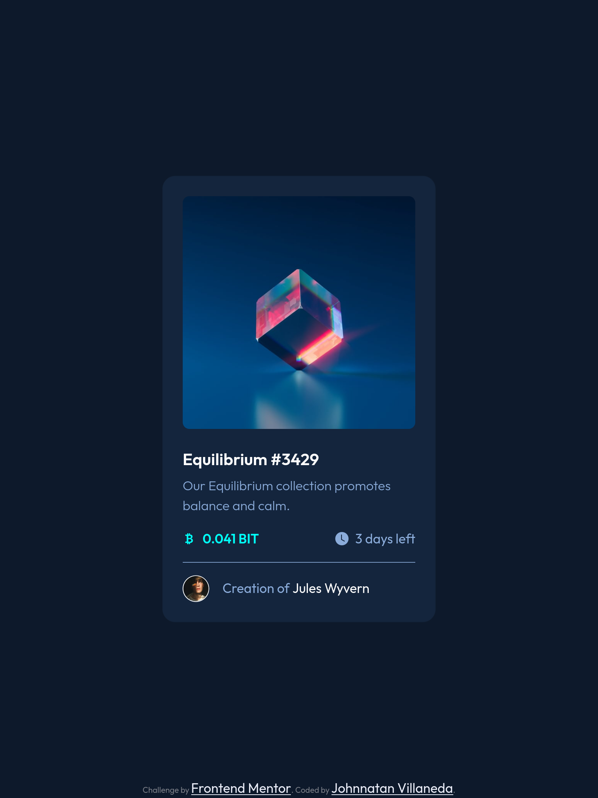

# Frontend Mentor - NFT preview card component solution

This is a solution to the [NFT preview card component challenge on Frontend Mentor](https://www.frontendmentor.io/challenges/nft-preview-card-component-SbdUL_w0U). Frontend Mentor challenges help you improve your coding skills by building realistic projects.

## Table of contents

- [Overview](#overview)
  - [The challenge](#the-challenge)
  - [Screenshot](#screenshot)
  - [Links](#links)
- [My process](#my-process)
  - [Built with](#built-with)
  - [What I learned](#what-i-learned)
  - [Continued development](#continued-development)
  - [Useful resources](#useful-resources)
- [Author](#author)

## Overview

<!--
### The challenge

Users should be able to:

- View the optimal layout depending on their device's screen size
- See hover states for interactive elements -->

### Screenshot

### Links

- Solution URL: [Add solution URL here](https://your-solution-url.com)
- Live Site URL: [Add live site URL here](https://your-live-site-url.com)

## My process

### Built with

- Semantic HTML5 markup
- SASS custom properties
- Bootstrap framework
- Mobile-first workflow

### What I learned

The correct use of bootstrap for basic layouts and add some custom pointers in Sass. The project was developed to test some of the options that offer bootstrap.

### Continued development

I want to keep practicing the tools and options that offers Bootstrap, Sass and how to mix this habilities whit Javascript or React.

### Useful resources

- [Example resource 1](https://getbootstrap.com/docs/5.3/getting-started/introduction/) - This is the oficial documentation of bootstrap.

## Author

- Website - [Johnnatan Villaneda](https://portfolio-cv-pi.vercel.app/)
- Frontend Mentor - [@JohnnatanV](https://www.frontendmentor.io/profile/JohnnatanV)
- Twitter - [@JohnnatanV](https://twitter.com/JohnnatanV)
